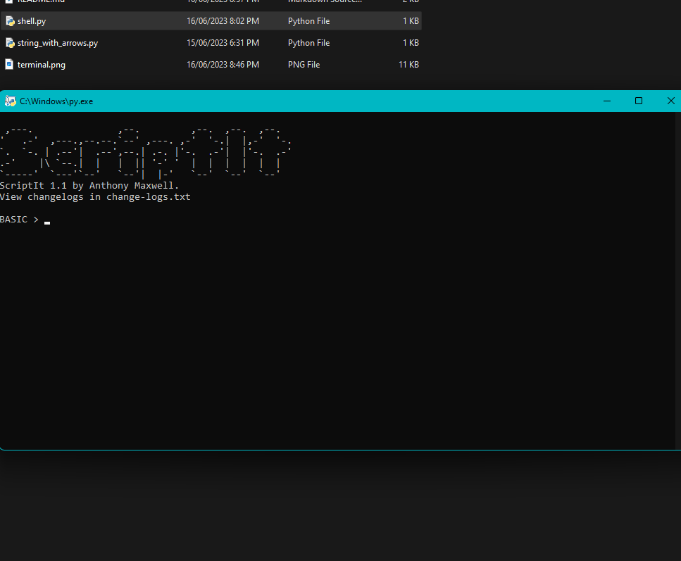

# ScriptIt
## About
ScriptIt is a new programming language developed solo by Anthony Maxwell. This is developed in python.
## Compatibility
ScriptIt only requires `Python 3+` to be installed.
## How can you use it?
So far I have it set up to be able to do:
- Answer mathematical equations (Including Paranthesis, Unary Operations, Binary Operations, Integers and Floats)
## How do you run it?
You can use it by going to the directory:
`C:\Users\{UserName}\Downloads\ScriptIt-main`
This directory will change depending on where you download it or where you move it to. Then, type cmd in the path.

Then type `py shell.py`. There is multiple variations and some may or may not work.
- `py3 shell.py`
- `python shell.py`
- `python3 shell.py`

You can also double click the program to run it.

## How to use the program.
As of now, the program only supports mathematical equations.
This includes:
- Order of Operations (Paranthesis, multiplication before addition, etc.)
- Binary Opeartions (+, -, *, /)
- Unary Operations (Negative numbers)
- Integers & Floats (Numbers and decimals)

### How do you use these commands?
It is very simple. Since, as of now, we only have mathematical equations, you can just type in the equation.

Examples:
- `10 + 10 * 2` -> `30`
- `(10 + 10) * 2` -> `40`
- `2 / 2 + 2` -> `2`

## Errors
### What are the errors and how do I solve them?
- IllegalCharError: You have inputed and illegall character that is not accepted. Valid Characters are: `Numbers 0-9`, `+`, `-`, `*`, `/`, `(` and `)`. Ignored characters include: ` `, `\` and `t`. Any other characters will raise this error (As of now, I am aware of the issue if you add nothing or only spaces. I am in the proccess of debugging.)
- InvalidSyntaxError: This means that you have given incorrect syntax. This could include: `Unmatched '('`, `Unmatched ')'`, `No numbers before/after symbols`, `Too many numbers without an operation.`, `Expected int, float, '+', '-' or '('`, `Expected an identifier` or `Expected '=' after variable identifier.`
- RuntimeError: This can occur when you Divide by zero or attempt to reference a variable that was not defined.

If there are any other issues, post them on the issues tab of this repository.