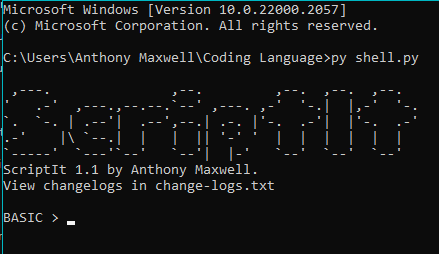

# ScriptIt
## About
ScriptIt is a new programming language developed solo by Anthony Maxwell. This is developed in python.
## Compatibility
ScriptIt does not use any modules. It only requires `Python 3+` to be installed.
## How can you use it?
So far I have it set up to be able to do:
- Answer mathematical equations (Including Paranthesis, Unary Operations, Binary Operations, Integers and Floats)
## How do you run it?
You can use it by going to the directory:
`C:\Users\{UserName}\Downloads\ScriptIt-main`
This directory will change depending on where you download it or where you move it to. Then, type cmd in the path.

Then type `py shell.py`. There is multiple variations and some may or may not work.
- `py3 shell.py`
- `python shell.py`
- `python3 shell.py`

You can also double click the program to run it.
